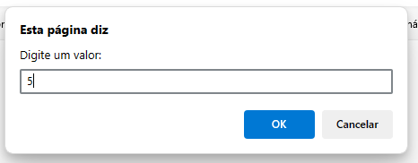
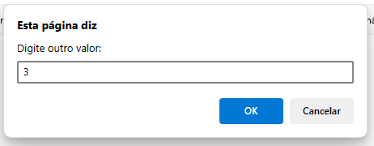
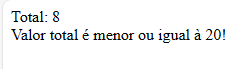
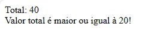

# javascript-SomaSimples
código no javascript que pede 2 números, soma eles e fala se o resultado é maior, menor ou igual a 20. bem simples, feito na primeira aula para aprender JS com o professor Anselmo Florentino.
 

  <h3>Um alert vem e pede dois números.</h3>
   

  <h3>Depois ele soma e fala se o valor é maior ou menor que 20. Aqui dois exemplos.</h3>
   

